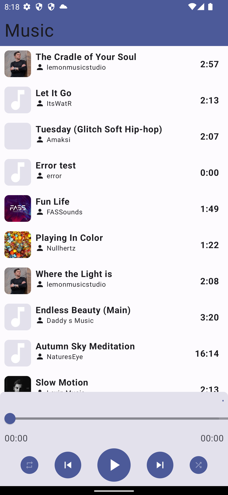
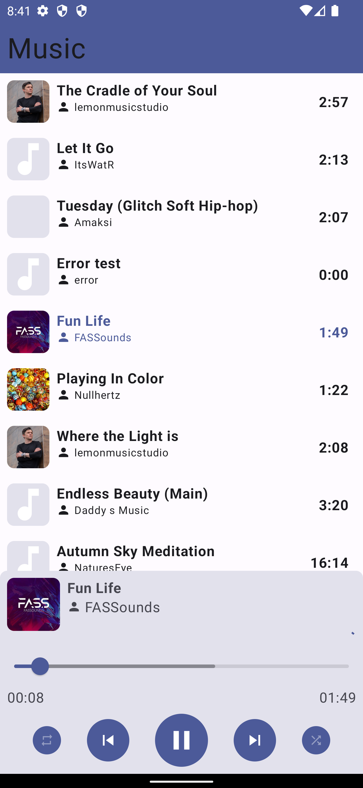

## Table of contents

* [General info](#general-info)
* [Technologies](#technologies)
* [Setup](#setup)
* [Current Features](#current-features)
* [Future Features](#future-features)

## General info

This android app has at its core the functionality of enabling the user to listen music.

## Technologies

* Kotlin
* Android Jetpack Compose
* Coil
* Media3
* ExoPlayer
* Hilt
* Glance
* ViewModel
* Material3

## Setup

There are no steps required to run the project.
If you only want to have a try at the app you can go [here](https://github.com/RuiAlves99k/android-music/tree/main/apks)and download the apk.

## Current Features

Music app has only one screen where the user has a playlist.

{ height: 200px; }
{ height: 200px; }

## Future Features

* Widget to control the media player
* Custom playlist
* Streaming
